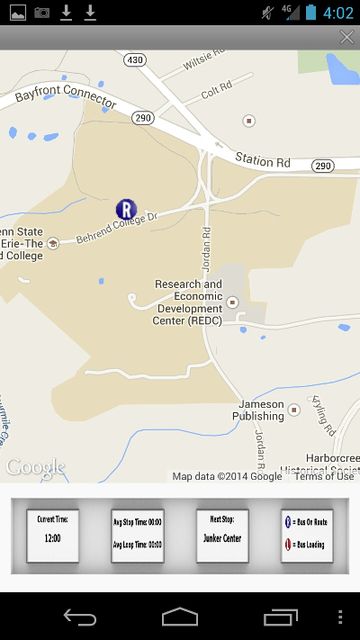
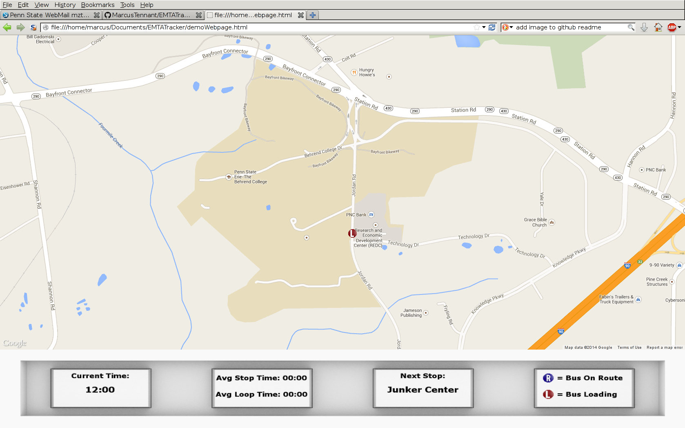

EMTATracker
===========

EMTATracker is a gps tracker that utilizes the 3g network to enable municiple vehicle tracking in virtually any city.
Developed as a proto type for the Erie Metro Transport Authority by Jeff Knapp, Matt Smith and Marcus Tennant.

The backend consists of a java program controlling a mail server using a google api.
The front end pulls the data provided by the mail server and makes use of the google maps api to display the tracking data in real time.

Designed with three goals in mind (ability to be used virtually anywhere in the US, robustness, and ease of installation), the only hardware needed is an Arduino with gps and 3g module, and a 5v power connection on whatever bus subway etc, you're tracking.

The front end is designed for both desktop and mobile in Javascript and HTML5 so no app installation is needed. 

Also provided in this repo is a test loop of gps data pulled from our arduino of a drive around Penn State Behrend.

Android

Desktop

